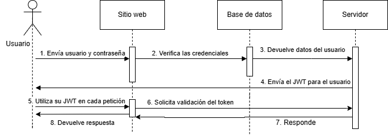
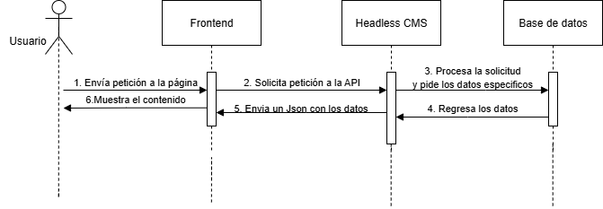

# Laboratorio#1 Bryan Londoño Marchena!

## 1. *Frameworks de desarrollo web📰*

Framework seleccionado - **Vue**

**a. ¿Qué es un framework y qué problema resuelve?**
En si un framework lo que hace es darnos una plantilla o una base con la cual empezar a trabajar en el desarrollo de aplicaciones de forma que nos ahorra tiempo en ciertas tareas que antes tal vez fueran más rutinarias, de esta forma los programadores se pueden centrar más en la lógica y en el funcionamiento del mismo.

**b. Arquitectura general y enfoque (MVC, SPA, SSR, etc.).**
La arquitectura de *Vue* se basa en el modelo MVVM (modelo - vista - vista modelo) el cual es uno relativamente nuevo además de esto, la separación lógica que contiene lo hace muy flexible y ordenado pues se basa en separar la parte de la capa de presentación y la lógica empresarial, además de esto sus componentes se utilizan en base a su estado

**c.** **Ejemplo práctico documentado (estructura de proyecto, fragmento de código comentado).**
Estructura de un proyecto en Vue
├── node_modules/  
├── public/  
│ └── index.html  
├── src/  
│ ├── assets/  
│ ├── components/  
│ ├── router/  
│ ├── stores/  
│ ├── App.vue  
│ └── main.js # O main.ts si se usa TypeScript  
├── .eslintrc.js  
├── .gitignore  
├── .prettierrc.json  
├── .vscode/  
├── e2e/  
├── .env  
├── package.json  
├── package-lock.json  
├── playwright.config.js  
├── vitest.config.js  
└── vite.config.js
En este caso la carpeta denominada como **public/** sería la carpeta raíz de nuestro proyecto en esta vamos a guardar los ficheros estáticos o los que no van a ser utilizados por el framework.
Luego está la carpeta **src/** que es la carpeta o por lo menos es considerada por mí persona como la más importante pues en este tendremos nuestro código fuente generalmente, aquí están los archivos que vamos a modificar mediante un editor de texto, además de estos dependiendo de la configuración del proyecto ya sea **typescript** o **javascript** tendremos un archivo **main.ts** o **main.js* .*
Luego tendremos un archivo como App.vue el cual es casi como un html porque tiene 3 estructuras que son **< template >**, **< script >** y **< style >** 
En la carpeta **assets** guardaremos los archivos estáticos como lo pueden ser las imágenes, audios o videos estos son los que utilizaremos dentro de nuestro código. 
La carpeta **router** sirve para crear rutas dentro del frontend esto lo podemos utilizar para crear aplicaciones con APIS, generalmente su archivo se llama **index.js** o **index.ts**.
Para la carpeta **stores** generalmente esta solo se utiliza si se combina con pinia o para almacenar algún tipo de estado y por último la carpeta **components/**  en esta carpeta se van a guardar los archivos **.vue** que se creen durante la ejecución del proyecto es importante recordar que estos son los que contienen html, css y js 

**d.** **Comparación breve entre al menos dos frameworks (según lenguaje o enfoque).** 

 **Comparación breve: Vue vs Angular**
| Característica        | Vue.js | Angular |
|----------------------|--------|---------|
| Lenguaje principal   | JavaScript | TypeScript |
| Curva de aprendizaje | Baja  | Alta |
| Escalabilidad        | Media | Alta |
| Velocidad de despliegue | Rápida | Más lenta |

---

## *2. Control de versiones y trabajo colaborativo🫱🏻‍🫲🏼*

**a. ¿Qué es el control de versiones y por qué es esencial?** 
Un control de versiones se puede observar como una lista en las cuales se tendrán diferentes progresos o partes del proyecto según se requiera esto generalmente para llevar un mejor orden y así evitar problemas ante futuras actualizaciones.

**b. Conceptos clave: repositorio, commit, branch, merge, pull request.**
***Repositorio:*** Se puede observar como un sistema de almacenado el cual contiene grandes cantidades de información.
***Commit:*** Se puede decir que es como un pre-guardado antes del guardado final.
***Branch:*** Con esto se refiere especificamente a una rama la cual puede consistir en partes del proyecto que se separan para formar un todo. 
***Merge:*** Esto es cuando se quiere realizar cambios en una rama la cual ya tiene cierto tipo de contenido.
***Pull request:*** Esto lo podemos observar como la acción de pedir subir nuestros cambios a la rama que deseemos y estos si son aprobados van a ser subidos a la rama en que se haya realizado.

**c. Flujos de trabajo comunes (Git Flow, trunk-based, feature branches).** 
Uno de estos flujos de trabajo es el flujo de trabajo centralizado lo que hace es que utiliza un repositorio central generalmente esta rama se llama Main y los cambios se realizan en esta rama si o si, en este caso uno de los supervisores debe confirmar todos los cambios o devolverlos en caso de que no cumplan los estándares, un ejemplo de estos es en la página de github. 

**d.  Ejemplo de cómo usar Git en un proyecto (inicialización, commits, ramas).**
Lo primero es tener una cuenta creada y estar en nuestra computadora, en este caso crearemos una carpeta donde vamos a guardar el repositorio, en este caso lo que se puede hacer es clonar un repositorio o crearlo desde cero en nuestra carpeta, entonces lo primero que haremos son los siguientes pasos:
1. Entrar en nuestra carpeta y abrir una terminal de comandos
2. Escribir lo siguiente *git innit* 
3. Sino tenemos la cuenta registrada se nos pedirá que la iniciemos 
4. Luego verificamos que exista una carpeta que se llame .git 
5. Después podemos agregar archivos como echo "# Mi proyecto" > README.md
6. Hacemos un git add . en caso de haber agregado archivos
7. Luego un commit para ir subiendo estos cambios y darle un nombre, escribimos lo siguiente *git commit -m "Prueba commit"*
8. Luego aca cambiamos el nombre de la rama *git branch -M main* 
9. *git push -u origin main* y guardamos los cambios que habíamos realizado. 
10. Esto es opcional, pero si queremos crear más ramas hacemos esto *git branch pruebaRama2*
11. Si queremos hacer cambios en la nueva rama es importante hacer lo siguiente que es pasarse de rama *git checkout pruebaRama2*

**e. Herramientas recomendadas (GitHub, GitLab, Bitbucket).**  
De forma personal y por experiencia recomendaría Github pues es una forma de utilizar repositorios de forma sencilla y sin muchas complicaciones pues te da muchas herramientas al momento de subir archivos además que por decirlo de alguna manera te protege ante posibles errores avisando si hay algún commit mal hecho o si un merge está muy por encima del otro entre otras cosas, sin embargo, en el mercado tecnologico se encuentras otras opciones igual de buenas como lo son: Taravault, Bitbucket y SourceForge.  

## *3. Autenticación y seguridad moderna🧐*

**a. Conceptos: autenticación, autorización, tokens, JWT, OAuth.**
**Autentificación:** Según Microsoft es el proceso que usan las empresas para confirmar que solo las personas, servicios y aplicaciones adecuados con los permisos correctos pueden acceder a recursos de la organización.
**Autorización:** La autorización es un método que comprueba que las credenciales solicitadas por una plataforma o persona sean correctas y de esta forma permite un acceso. 
**Tokens:** En general un token es reconocido por ser un tipo de activo digital, en estos casos puede representar monedas digitales, derechos de autor o el acceso a ciertos tipos de servicios. 
**JWT (Json Web Token):** Es un tipo de token el cual se encarga de recibir ciertos tipos de datos en formato Json para verificar la propiedad de una persona, la diferencia es que la cadena ya viene codificada y con URL seguro para ser utilizada. 
**OAuth:** Según Microsoft es un estándar tecnológico que permite autorizar a una aplicación o servicio a iniciar sesión en otra sin divulgar información privada, como contraseñas.

**b. Diagrama de flujo explicativo del proceso de autenticación con JWT.**

**c. Buenas prácticas en seguridad web.**
1. No dejar ninguna contraseña de forma que sea visible o algún dato sensible a la vista.
2. Utilizar protocolos https con certificado SSL para mayor seguridad.
3. Realizar copias de seguridad.
4. Limitar las acciones por medio de roles. 
5. Pedir autentificación de dos pasos para todos los usuarios.

**d. Aplicaciones reales en plataformas modernas.** 
Actualmente hay muchas de estas empresas que utilizan los consejos anteriores y más, algunas de estas podrían ser: Epic games la cual no importa en qué momento uno intente entrar siempre te va a pedir que, aunque coloques la contraseña de forma correcta lo verifiques por medio de un factor de dos pasos, además de esta tenemos a Google que utilizan los protocolos HTTPS y que permiten el uso de OAuth para iniciar sesión con otras aplicaciones y por último podríamos mencionar que el Auth0 utiliza JWT para la emisión de tokens. 

## *4. Gestores de contenidos desacoplados (Headless CMS)👀*

**a.Definición de Headless CMS vs CMS tradicional.**
**Headless CMS:** Este sistema se enfoca totalmente en lo que compete al backend o sea con la información que no está a la vista pues en esta se da la creación, modificación o el envio de estos mismos, pero no muestra nada con respecto al frontend. 

**CMS tradicional:** En este tipo de sistema el backend y el frontend estan fuertemente conectados, de forma que se puede ver como una asociación fuerte pues el uno sin el otro no funciona de la forma esperada, sino que fueron creados para mostrar y reproducir el contenido entre ellos mismos.

**b. Arquitectura basada en APIs.** 
Generalmente su arquitectura se basa en el aprovechamiento por medio de APIS, pero no solo esto además utilizan un sistema de archivos o un almacenamiento de datos en la nube. Para solicitar el contenido estas utilizan las APIS de forma que con algún tipo de estas como lo pueden ser GraphQL O RESTful eligen de manera específica los datos o el contenido que desean traer para así poder mostrarlo de una forma constante o algunas lo combinan con un CRUD para su creación, lectura, actualización y eliminación de los datos que se tienen en el backend de forma que se mantiene más ordenado y limpio al momento de trabajar. 

**c. Ventajas, limitaciones y casos de uso comunes.**
**Ventajas:** 
1. Mayor flexibilidad al momento de modificar la capa de presentación.
2. Puede distribuir el contenido a distintas plataformas por medio de su API.
3. Tiene mayor escalabilidad en caso de ser necesario la agregación de más contenido.
4. Tiene mayor rendimiento pues solo consume los datos necesarios. 
**Limitaciones:**
5. Es más complejo pues este como tal no cuenta con un frontend.
6. Es muy dependiente de las APIS para su funcionamiento.
7. Necesita de conocimiento previo en APIS por lo cual la curva de aprendizaje es más lenta.
8. Prácticamente que no tiene plantillas ya predefinidas pues como cada una varía mucho por el tipo de dato que consuma no es tan eficiente el que existan. 

**d. Ejemplo de cómo se conecta el frontend a un CMS headless.**

## *5. Pasarelas de pago en aplicaciones web🤑*

**a. ¿Qué es una pasarela de pago? ¿Qué rol cumple en una aplicación moderna?** 
Una pasarela de pago se puede ver como un método el cual contiene distintos servicios monetarios los cuales están a disposición de los usuarios y por el cual al utilizar uno de estos servicios se va a poder efectuar una transacción monetaria con el fin de pagar por un producto o servicio final. El rol que estos cumplen es el de automatizar procesos y el poder realizar compras en línea. 

**b. Requisitos comunes: cuenta de comercio, seguridad, integración técnica.**
**Cuenta de comercio:** Es una cuenta de banco especializada y dada por un banco oficial con el fin en que una empresa pueda recibir pagos y aceptar pagos de manera electrónica. 
**Seguridad:** Para los casos en los que la información es tan sensible es necesario utilizar encriptación y si es posible la tokenización para así sustituirlo por los datos de la tarjeta de forma que si se roban algo es solo un token y no la información real, además de esto se deben seguir las leyes informáticas de cada país con respecto a las transacciones bancarias. Además, existen ciertas normas a utilizar que son casi como un estándar las cuales se denominan PCI DSS en estas hay ciertos pasos o reglas a seguir para mantener las transacciones de una forma más segura. 
**Integración tecnica:** En este apartado lo más importante a definir es el tipo de API a utilizar y el tipo de información que se va a estar enviando a la pasarela, además de esto los tipos de verificaciones que se van a solicitar, para llevar a cabo el tener una pasarela robusta es necesario generar distintas pruebas a modo de observar si algo falla o si hay alguna posibilidad de filtrar la información.

**c. Ventajas y limitaciones de integrar pagos en línea.**
**Ventajas:**
	1. Hace más llamativo al sitio web.
	2. Mejora la experiencia del cliente.
	3. Permite una mayor expansión territorial.
	4. Ofrecen muchas alternativas al cliente.
**Limitaciones:**
	1. Generalmente se cobran comisiones al utilizarse.
	2. Es necesario utilizar sistemas de terceros (APIS)
	3. Puede existir el fraude (pagos con tarjetas robadas)
	4. Se tiene que invertir mucho dinero en la seguridad y en las pruebas.

**d. Comparación entre al menos dos pasarelas (ej. Stripe, TiloPay, Bancos, etc.)**
Mi comparación la realizo a modo personal, en este caso yo elegí a **Paypal** y **Skrill** 
| Característica               | PayPal             | Skrill            |
|------------------------------|--------------------|-------------------|
| Comisiones de retiro         | Menores            | Mayores (≈7%)     |
| Envío de dinero sin cuenta   | No                 | Sí                |
| Tipo de cambio               | Menos favorable    | Menos favorable   |
| Métodos de pago soportados   | Tarjeta, cuenta bancaria, saldo PayPal | Tarjeta, cuenta bancaria, criptomonedas |

## *6. Automatización del despliegue y hosting moderno🚀*

**a. ¿Qué es CI/CD y por qué se usa en desarrollo web?**
**CI (Integración continua):** Consiste en integrar los cambios del código en un repositorio de código fuente compartido de forma automática y frecuente. 
**CD (Distribución continua):** Es un proceso de dos partes que implica la integración, la prueba y la distribución de los cambios en el código. Mientras que en la distribución continua los cambios no llegan a implementarse en la etapa de producción de forma automática, en la implementación continua sí se logra. En general se usan en el desarrollo web pues permiten captar los errores con mayor facilidad y aunado a esto permite un mejor desarrollo durante todo el proceso pues al tener distintas fases se hacen mejores trabajos y con mayor retroalimentación. 

**b.  Hosting estático vs dinámico.**
Diferencias entre hostings 
| Estático            | Dinámico          |
|---------------------|-------------------|
| Fácil de construir  | Muy interactivo   |
| Económico           | Personalizable    |
| Poco interactivo    | Más costoso       |
| Sin base de datos   | Muy escalable     |

**c. Flujo de despliegue automatizado.**
**Pasos para crear un flujo de despliegue automatizado**
1. Lo primero sería crear los archivos o documentos que vaya a contener.
2. Después se crea un repositorio en nuestra plataforma de preferencia (en este caso Github).
3. Conectamos nuestro repositorio con nuestra carpeta de archivos.
4. Creamos el control de versiones o sea generamos un git add, commit, push y pull.
5. Luego se procede a buscar nuestra plataforma de hosting para realizar el despliegue.
6. Agregamos nuestro repositorio a Netlify por ejemplo.
7. Desplegamos el repositorio. 
8. Listo ahora cada vez que se hagan cambios en el repositorio este se verá publicado.

**d. Documentar el proceso seguido para desplegar la parte 2 del laboratorio**
	Pasos a seguir para el **despliegue** de la segunda parte del laboratorio. 
1. Haber creado un repositorio
2. Agregar la información del laboratorio#1 al README.md
3. Agregar el archivo que nos dio el profesor al repositorio
4. Guardar los cambios
5. Entrar a Netlify.
6. Crearse una cuenta o loguearse si ya la hemos creado previamente.
7. Una vez entramos nos pedira información personal como nombre, apellido, para qué pensamos utilizar la app, el tipo de proyecto que pensamos utilizar y lo que mejor describe nuestro rol, todo esto es totalmente personal.
8. Luego nos dice que despleguemos nuestro primer proyecto, en ese caso nos muestra cuatro opciones que son Github, Gitlab, Bitbucket y Azure devOps.
9. Seleccionamos una de las opciones. 
10. Luego nos dira que escojamos un repositorio previamente creado.
11. Seleccionamos el repositorio.
12. Le damos al boton que dice "Deploy nombreDeTuProyecto to Netlify"
13. Esperamos unos momentos 
14. Nos muestra una pantalla de configuración donde aparece nuestro link en un color verde claro.
15. Lo presionamos y observamos los resultados 

[Link del Netlify](https://adorable-shortbread-35939b.netlify.app/)

**Fuentes:** 
1. [Framework: qué es y para qué sirve, significado, ejemplos, características y tipos](https://ebac.mx/blog/frameworks)
2. [Introducción — Vue.js](https://es.vuejs.org/v2/guide/#Empezando)
3. [Frameworks para desarrollo web: 15 ejemplos con características](https://blog.hubspot.es/website/framework-desarrollo-web)
4. [Flujo de trabajo de Git | Atlassian Git Tutorial](https://www.atlassian.com/es/git/tutorials/comparing-workflows)
5. [Iniciar repositorio Git y primer commit](https://desarrolloweb.com/articulos/iniciar-repositorio-git-primer-commit.html)
6. [Las 14 mejores alternativas GRATUITAS de GitHub (2025)](https://www.guru99.com/es/github-alternative.html)
7. [¿Qué es la autenticación? Definición y métodos | Seguridad de Microsoft](https://www.microsoft.com/es-mx/security/business/security-101/what-is-authentication?msockid=06b89eb8d93e62e727b68b8bd82263ee)
8. [¿Qué es un token, cómo funciona y para qué sirve? Tipos y ejemplos - Finect](https://www.finect.com/usuario/avillanuevae/articulos/que-es-un-token-como-funciona-y-para-que-sirve-tipos-y-ejemplos)
9. [Autenticación JWT, qué es y cuándo usarla | Ciberseguridad](https://ciberseguridad.com/guias/prevencion-proteccion/autenticacion-jwt/#%C2%BFQue_es_JWT)
10. [¿Qué es OAuth? | Seguridad de Microsoft](https://www.microsoft.com/es-es/security/business/security-101/what-is-oauth?msockid=06b89eb8d93e62e727b68b8bd82263ee)
11. [Las 10 MEJORES PRÁCTICAS de SEGURIDAD para tu SITIO WEB](https://km32.com/mantenimientos-webs/mejores-practicas-seguridad-sitio-web/)
12. [Headless CMS vs CMS tradicional: Diferencias clave](https://www.alumio.com/es/blog/headless-cms-vs-traditional-cms-key-differences)
13. [Headless CMS vs. CMS tradicional: ventajas y desventajas en comparación - alojamiento web](https://webhosting.de/es/headless-cms-vs-tradicional-cms-comparacion-ventajas-y-desventajas/)
14. [Cuenta de Comerciante vs. Pasarela de Pago: Principales diferencias](https://blog.payproglobal.com/es/merchant-account-vs-payment-gateway)
15. [Puntos esenciales de la seguridad de las pasarelas de pago para el comercio electrónico - 10Web](https://10web.io/blog/es/puntos-esenciales-de-la-seguridad-de-las-pasarelas-de-pago-para-el-comercio-electronico/)
16. [La integración y la distribución continuas (CI/CD)](https://www.redhat.com/es/topics/devops/what-is-ci-cd)
17. [Sitio web estático vs. dinámico: en qué se diferencian y cuál es la mejor elección - BC de SiteGround](https://www.siteground.es/kb/sitio-web-estatico-vs-dinamico/)
